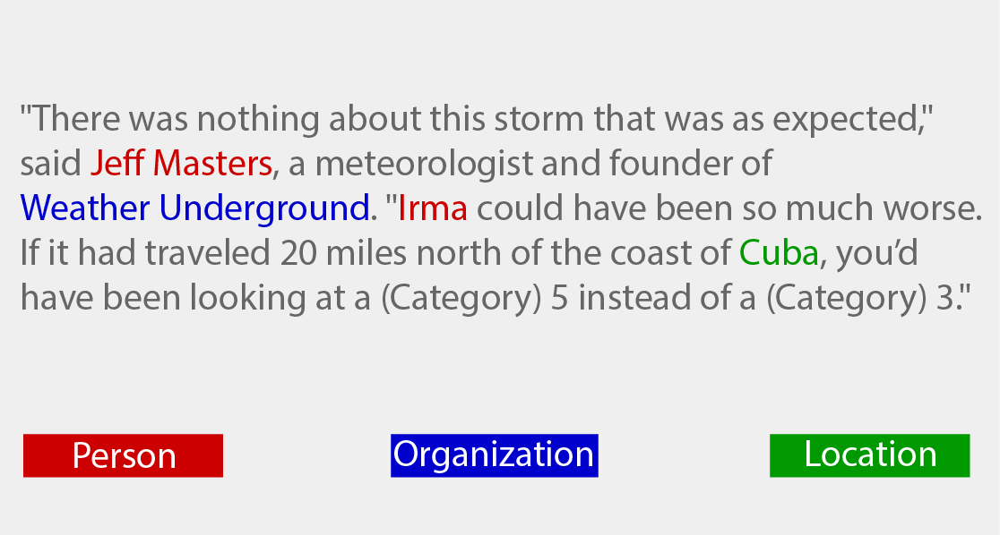
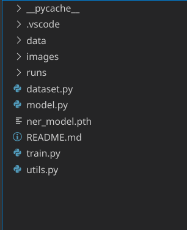

# **Report on Named Entity Recognition [NER]**


Named-entity recognition (NER) is a sub-task of information extraction that seeks to locate and classify named entities in text into pre-defined categories such as the names of persons, organizations, locations, expressions of times, quantities, monetary values, percentages, etc. 


    
Most research on NER systems has been structured as taking an unannotated block of text, such as this one: 


`Jim bought 300 shares of Acme Corp. in 2006.` 

And producing an annotated block of text that highlights the names of entities: 

`[Jim] Person bought 300 shares of [Acme Corp.]Organization in [2006]Time.` 

In this example, a person name consisting of one token, a two-token company name and a temporal expression have been detected and classified. Here is another example:



In this project, we explore the problem of Named Entity Recognition tagging of sentences. The task is to tag each token in a given sentence with an appropriate tag such as Person, Location, etc.

## Dataset
Our dataset will need to load both the sentences and labels. We will store those in 2 different files, a sentence.txt file containing the sentences (one per line) and a labels.txt containing the labels. For example:


`#sentences.txt
John lives in New York
Where is John ?`

and corresponding labels are:

`#labels.txt
B-PER O O B-LOC I-LOC
O O B-PER O`

Here `PER, LOC` denote person names and locations respectively and `B-` denotes the beginning and `I-` inside of an entity. All other words, which don’t refer to entities of interest, are labelled with the `O` tag.

Three datsets are available: train, valid and test.

# Summary of the Dataset:
Count of Words/Labels in Train Sentences: 33570

Count of Words/Labels in Val Sentences: 7194

Count of Words/Labels in Test Sentences: 7194

No prior pre-processing of the raw data is done (such as Stemming, Lemmatization..)
In this project, we are exploring the use of RNN based model approaches to tackle the task of NER:

# **Model architecture** 
The architecture employed here consists of 
1. Embedding layer
2. Bidirectional LSTM
3. Dropout layer
4. Feedforward layer 
5. Output layer with softmax activation function


# **Preprocessing** 
Generate vocabulary for the words in the dataset and save it in words.txt and tags.txt files. 
The text tokens in the dataset is converted to indices based on the vocabulary defined above using the bag of words approach. 

Seperate dataset is generated for train, val and test followed by generating dataloaders for batch processing. 
Each sentences in the dataloader is padded with padding tokens to match the maximum size of the sentence in the batch. 

While calculating loss and accuracy, the padding tokens are ignored to output valid score with respect to the dataset provided. 

# ** Training **
The trained model achives an accuracy of 94.28% on training set and 93.8% on test set. 


## Directory Structure



### 3. Running example:
Environment: python 3

Requirements:
```python
pytorch
```
running example:
```python
python train.py
```
   